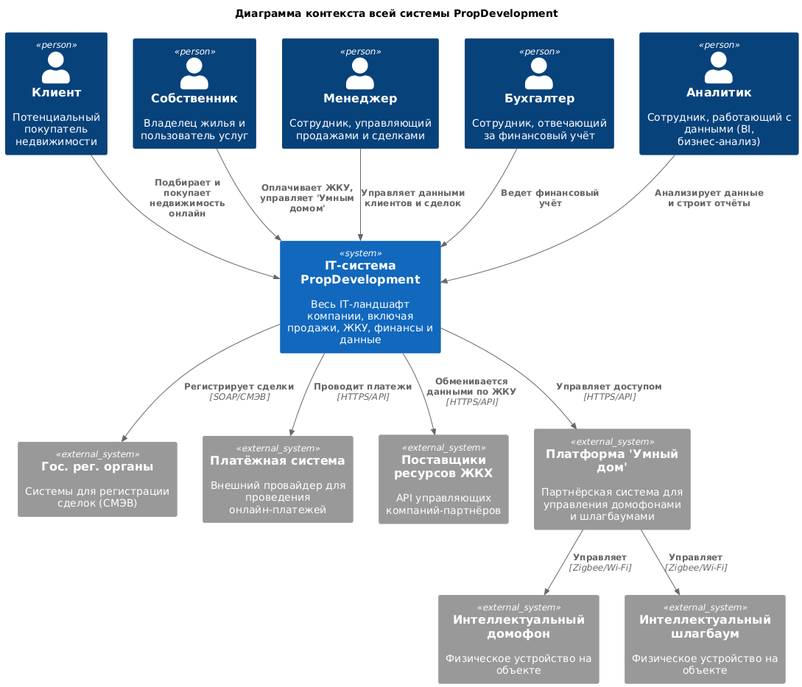
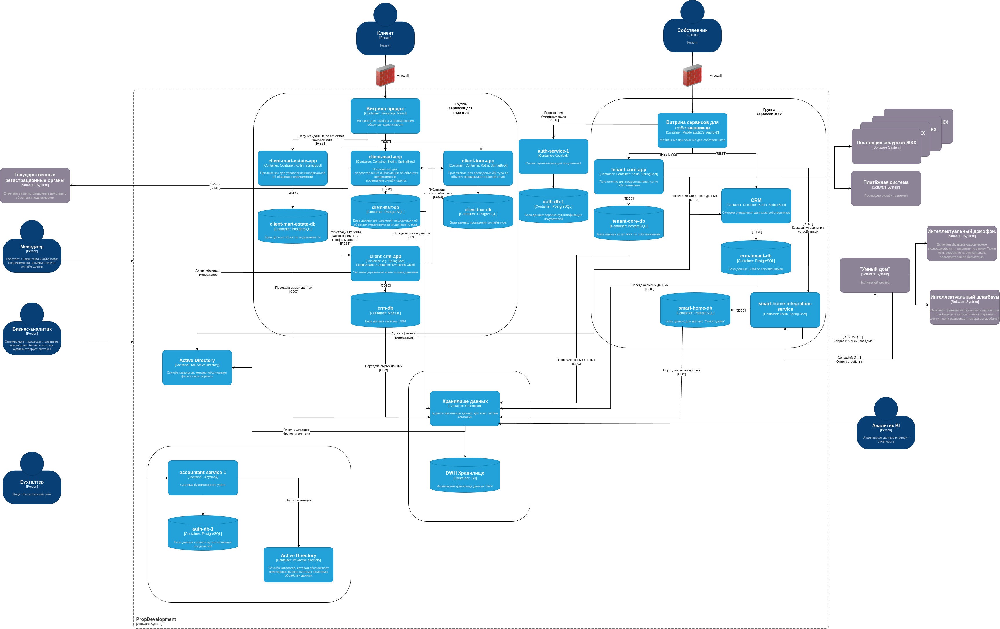

# Задание 3. Внешние интеграции

## Полная диаграмма контекста С4

Ссылка на [plantuml](./context_diagram.plantuml) файл

То же, но картинкой:

 

## Доработанная диаграмма контейнеров C4

Ссылка на [drawio](./PropDevelopment_С4_model.drawio) файл

То же, но картинкой:

 

## Требования к безопасности

1.  **Шифрование канала связи:** Все взаимодействия между системой PropDevelopment и платформой партнёра должны осуществляться исключительно по защищенному каналу с использованием протокола **TLS версии не ниже 1.2**.
2.  **Аутентификация и авторизация:** Доступ к API партнёра должен быть защищен. Система PropDevelopment должна аутентифицироваться как клиент API. Каждый запрос должен быть авторизован.
3.  **Принцип минимальных привилегий:** API-ключ, используемый для интеграции, должен иметь доступ только к тем методам и данным, которые необходимы для работы функций домофона и шлагбаума. Он не должен давать прав на управление другими системами партнёра или доступ к данным других клиентов партнёра.
4.  **Защита персональных данных:**
    *   Передача биометрических данных (фотографии для распознавания лиц) должна осуществляться по защищенному каналу и храниться на стороне партнёра в зашифрованном виде.
    *   В API не должны передаваться избыточные персональные данные собственников (например, ФИО, паспортные данные), а только идентификаторы, необходимые для привязки прав доступа.
5.  **Безопасность Webhook:** Входящие запросы от партнёра (вебхуки) должны проверяться. Необходимо убедиться, что запрос действительно пришел от платформы партнёра, например, путем проверки цифровой подписи запроса с использованием предварительно согласованного секрета.
6.  **Аудит и логирование:** Все запросы к API партнёра и входящие события должны логироваться на стороне PropDevelopment для возможности расследования инцидентов.

## Протоколы аутентификации и авторизации

1.  **Аутентификация системы:** Для аутентификации сервиса-адаптера PropDevelopment в API партнёра должен использоваться протокол **OAuth 2.0** в режиме `Client Credentials`. Это позволит получить токен доступа, который будет использоваться для всех последующих запросов.
2.  **Авторизация запросов:** Каждый вызов API должен сопровождаться передачей полученного токена доступа (Access Token).
3.  **Управление доступом пользователей:** Управление правами конкретного собственника (например, добавление его лица в базу домофона) должно происходить через API партнёра, но инициироваться из системы PropDevelopment после внутренней авторизации пользователя.

## Организация взаимодействия

1.  **Архитектурное решение:** В системе PropDevelopment создается новый микросервис — **Smart Home Adapter**. Он инкапсулирует всю логику взаимодействия с API партнёра, выступая единой точкой входа для всех запросов к платформе "Умный дом".
2.  **Синхронные запросы (PropDevelopment -> Партнёр):**
    *   **Сценарии:** Открытие двери/шлагбаума по команде из приложения, добавление/удаление номера автомобиля, добавление/удаление биометрических данных.
    *   **Реализация:** Мобильное приложение через `tenant-core-app` вызывает методы `Smart Home Adapter`. Адаптер, в свою очередь, формирует и отправляет авторизованный **REST/gRPC** запрос к API партнёра.
3.  **Асинхронные события (Партнёр -> PropDevelopment):**
    *   **Сценарии:** Уведомление о звонке в домофон, событие успешного/неуспешного распознавания лица или номера автомобиля.
    *   **Реализация:** `Smart Home Adapter` устанавливает постоянное **WebSocket** соединение с платформой партнёра для получения событий в реальном времени. Адаптер обрабатывает событие и при необходимости передает его дальше (например, отправляет push-уведомление пользователю через `tenant-core-app`).
4.  **Хранение данных:**
    *   Список разрешенных номеров автомобилей и идентификаторы пользователей для биометрии хранятся в базе данных `tenant-db` и синхронизируются с платформой партнёра через `Smart Home Adapter`.
    *   Сами биометрические шаблоны хранятся на стороне партнёра.
